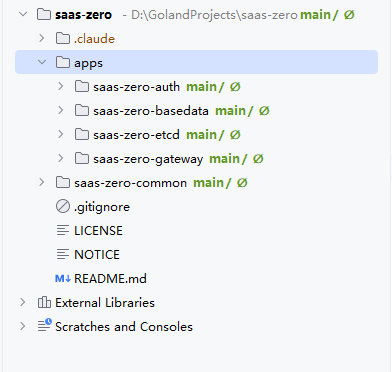

# SaaS-Zero

> 基于 **go-zero + ent + Casbin** 构建的多租户 SaaS 微服务后端平台。


[](https://github.com/saas-zero/saas-zero)
[](https://gitee.com/saas-zero/saas-zero)

SaaS-Zero 是一套可直接落地的多租户 SaaS 中后台微服务解决方案，覆盖**租户开通、RBAC 权限、菜单/API 管理、套餐、字典、审计日志**等企业级后台核心能力，并用 **Ent Mixin 钩子 + Redis 会话控制 + Casbin 运行时鉴权** 把重复的样板代码降到最低。

- 单体思路的**微服务分层**：Gateway 统一入口，认证与业务分离
- 一套代码同时服务**多个租户**，行级 `tenant_id` 逻辑隔离
- **目录不可见数字**：所有返回前端的大整数 ID 自动转 string，前端零精度丢失
- 完善的 **domain RBAC**：角色 → 菜单（前端导航）+ API（Casbin 运行时鉴权）
- **继承式授权**：只能把自己拥有的权限授给别人，杜绝越权提权
- 全程可观测：登录日志 + 操作日志 + 审计字段自动填充

---

## 功能特性

| 特性 | 说明 |
|---|---|
| 🏢 **多租户** | 共享数据库 + 行级 `tenant_id` 隔离；字典支持"系统默认 + 租户自定义"继承覆盖 |
| 🔐 **双轨权限** | 前端菜单走 `sys_role_menus`，后端 API 走 Casbin Domain RBAC（`casbin_rule` 表） |
| 📦 **套餐体系** | 套餐 = 菜单模板 + API 模板；开通租户时自动继承并补全按钮权限 |
| 🧬 **Ent Mixin 钩子** | 雪花 ID / 审计字段（created_by 等）/ 软删除 / 租户字段全自动填充，Logic 无样板代码 |
| 🎫 **JWT + Redis 会话** | token 存 Redis，`tokenVersion` 变更即踢旧会话（改密、重配权限后立即失效） |
| 🧮 **ID 精度零丢失** | int64 对前端不可见，统一 string 输出，禁止 `idStr \|\| id` 回退写法 |
| 🗂 **审计与日志** | 登录日志 + 操作日志（模块/操作/IP/耗时/参数）+ 审计字段自动写入 |
| ⚙️ **初始化 API** | 全新环境 `/init/all` 一键初始化（菜单/套餐/租户/角色/用户/Casbin），幂等可重跑 |
| 🔄 **策略热加载** | Casbin 策略 30 秒自动重载，分配权限无需重启 |
| 💬 **统一响应** | `{code, msg, data}` 全局约定，错误码标准化（`errno` 包） |

## 架构总览

```
                     ┌─────────────┐
                     │  客户端 / 前端  │
                     └──────┬──────┘
                            │ HTTP
                     ┌──────▼──────┐
                     │    API 网关   │  go-zero-gateway  (纯 HTTP 代理, 不鉴权)
                     │  :18080      │
                     └──┬──────┬───┘
                        │      │
                 HTTP   │      │ HTTP
          ┌─────────────▼──┐ ┌─▼──────────────────────┐
          │   认证服务       │ │  基础数据 API          │
          │  :18081        │ │  :18083                │
          │  登录/JWT/菜单   │ │  JWT → Casbin → Logic  │
          │  权限           │ │                        │
          └───────┬────────┘ └───────────┬────────────┘
                  │ gRPC                 │ gRPC
                  │              ┌───────▼────────┐
                  └──────────────│ 基础数据 RPC    │  :18084
                                 │  Ent / DB 核心  │  策略管理
                                 └───────┬────────┘
                                         │ Ent
                                  ┌──────▼──────┐
                                  │ PostgreSQL  │
                                  └─────────────┘
```

| 模块 | 协议 | 端口 | 职责 |
|---|---|---|---|
| [saas-zero-gateway](https://github.com/saas-zero/saas-zero-gateway) | HTTP 代理 | `:18080` | 统一入口，路径转发，**不做鉴权** |
| [saas-zero-auth](https://github.com/saas-zero/saas-zero-auth) | HTTP + gRPC | `:18081` | 登录、验证码、JWT 签发/校验/刷新、用户信息/菜单/权限码 |
| [saas-zero-basedata](https://github.com/saas-zero/saas-zero-basedata) | HTTP + gRPC | `:18083 / :18084` | API 层（JWT/Casbin/操作日志中间件）→ RPC 层（Ent 业务 + 策略管理） |
| [saas-zero-etcd](https://github.com/saas-zero/saas-zero-etcd) | etcd | — | etcd 调试工具 |
| [saas-zero-common](https://github.com/saas-zero/saas-zero-common) | Go 库 | — | Mixin / 雪花 ID / bcrypt / JWT / 加密 / Casbin / 错误码等公共库 |
| [saas-zero-web](https://github.com/Kun-GitHub/saas-zero-web) | 前端项目 |

## 技术栈

| 技术 | 用途 | 版本 |
|---|---|---|
| Go | 编程语言 | 1.25.3 |
| go-zero | 微服务框架（Gateway/RestRPC 模式） | v1.9.2 |
| ent | ORM / Schema-Mixin / 自动迁移 | v0.14.5 |
| PostgreSQL | 主数据库 | 15+ (via lib/pq) |
| gRPC / Protobuf | 服务间通信 | v3 |
| etcd | 服务发现 / 配置分发 | v3.5.15 |
| Casbin | 运行时 API 权限控制（Domain RBAC 多租户） | v2.135.0 |
| Redis | 会话 / Token 版本 / 验证码 | go-zero / go-redis |
| JWT | 认证令牌（含 roleCodes / tokenVersion） | golang-jwt/jwt/v5 |

## 快速开始

### 1. 环境要求

- Go 1.25+
- PostgreSQL 15+（数据库表由 **ent 自动迁移** 创建，无需手动 DDL）
- etcd v3.5+（本地可用 `127.0.0.1:2379`，亦可指向任意远程实例）
- Redis 6+

### 2. 克隆并启动（按顺序）

```bash
# 分别克隆各模块到对应目录（go.work 已聚合）
git clone https://github.com/saas-zero/saas-zero-auth.git        apps/saas-zero-auth
git clone https://github.com/saas-zero/saas-zero-basedata.git    apps/saas-zero-basedata
git clone https://github.com/saas-zero/saas-zero-gateway.git     apps/saas-zero-gateway
git clone https://github.com/saas-zero/saas-zero-common.git      saas-zero-common  
git clone https://github.com/Kun-GitHub/saas-zero-web.git      saas-zero-web  

# 1) 基础数据 RPC（gRPC，依赖 etcd + PostgreSQL）
go run ./apps/saas-zero-basedata/rpc

# 2) 基础数据 API（HTTP，依赖 RPC 就绪）
go run ./apps/saas-zero-basedata/api

# 3) 认证服务
go run ./apps/saas-zero-auth/api

# 4) 网关（统一入口）
go run ./apps/saas-zero-gateway
```

### 3. 验证

```bash
curl http://localhost:18080/oauth/code
# → {"code":200,"msg":"success","data":{...}}
```

### 4. 初始化数据

全新数据库执行一键初始化（跳过认证，幂等可重跑）：

```bash
curl -X POST http://localhost:18080/init/all
```

## 数据库设计（一行看懂）

- **11 张业务表**：`sys_users / sys_tenants / sys_roles / sys_menus / sys_depts / sys_apis / sys_dicts / sys_dict_datas / sys_packages / sys_login_logs / sys_operation_logs`
- **4 张 M:N 关联表**（ent 自动生成）：`sys_user_roles / sys_role_menus / sys_package_menus / sys_package_apis`
- **1 张 Casbin 策略表**：`casbin_rule`（adapter 自动创建，`v0=roleCode, v1=tenantId, v2=path, v3=method, v4=apiId`）
- 每张表通过 Ent Mixin 自动获得：雪花 `id`、`tenant_id`、`created/updated/deleted` 审计与软删除、`status/sort/remark`

## 接口总览

- **认证接口（9）**：`/oauth/login · verify · refresh · userinfo · menus · permissions · password/change · password/reset · code`
- **业务接口（60）**：用户 / 角色 / 菜单 / 部门 / 字典 / 字典数据 / 租户 / 套餐 / API / 日志，全部 `POST`（`delete` 传 `{ids: [...]}`）
- **初始化接口（5）**：`/init/all · package/create · tenant/create · user/create · role/create`

> 完整接口表格见 [ARCHITECTURE.md](./ARCHITECTURE.md) 与 [AGENTS.md](./AGENTS.md)。

## 文档导航

| 文档 | 面向读者 | 内容 |
|---|---|---|
| [ARCHITECTURE.md](./ARCHITECTURE.md) | 架构师 / 后端 | 分层设计、多租户、认证授权数据流、Casbin 模型、Ent Mixin、实体关系、关键决策 |
| [AGENTS.md](./AGENTS.md) | 开发者 / AI 辅助 | 代码风格、Mixin 用法、租户隔离查询、新增表/接口流程、Casbin 权限管理 |
| 各模块 `README.md` | 使用者 | 每个微服务独立仓库说明与使用入口 |

## 开源协议

[Apache License 2.0](./LICENSE)

```text
Copyright 2025 saas-zero and Kong
联系邮箱：hot_kun@hotmail.com
```

扫描二维码或点击右上角 ⭐ Star，感谢支持！

## 在线示例截图


