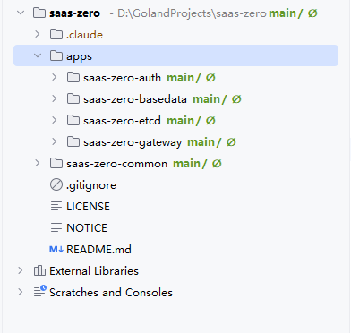

# SaaS-Zero

> 基于 **go-zero + ent + Casbin** 构建的多租户 SaaS 微服务后端平台。


[](https://github.com/saas-zero/saas-zero)
[](https://gitee.com/saas-zero/saas-zero)

SaaS-Zero 是一套可直接落地的多租户 SaaS 中后台微服务解决方案，覆盖**租户开通、RBAC 权限、菜单/API 管理、套餐、字典、审计日志**等企业级后台核心能力，并用 **Ent Mixin 钩子 + Redis 会话控制 + Casbin 运行时鉴权** 把重复的样板代码降到最低。

- 单体思路的**微服务分层**：Gateway 统一入口，认证与业务分离
- 一套代码同时服务**多个租户**，行级 `tenant_id` 逻辑隔离
- **目录不可见数字**：所有返回前端的大整数 ID 自动转 string，前端零精度丢失
- 完善的 **domain RBAC**：角色 → 菜单（前端导航）+ API（Casbin 运行时鉴权）
- **继承式授权**：只能把自己拥有的权限授给别人，杜绝越权提权
- 全程可观测：登录日志 + 操作日志 + 审计字段自动填充

---

## 三个版本怎么选

同一套 RBAC 权限模型，数据模型一致，按机器规格和团队规模分了三版：

|  | 基础版 | 微服务版 | 低配版 |
| --- | --- | --- | --- |
| 项目 | [RuoYi-Go](https://github.com/Kun-GitHub/RuoYi-Go) | **SaaS-Zero**（本仓库） | [mini-ruoyi](https://github.com/Kun-GitHub/mini-ruoyi) |
| 架构 | 单体 + DDD（六边形） | go-zero 微服务 + gRPC | 单体（Gin） |
| 进程数 | 1 | 4+（gateway / auth / basedata rpc+api / job） | 1 |
| 存储 | MySQL（默认）/ PostgreSQL | PostgreSQL + etcd + Redis | SQLite 单文件（纯 Go，零 CGO） |
| 前端 | RuoYi-Vue3 | [saas-zero-web](https://github.com/Kun-GitHub/saas-zero-web) | Svelte 5（后端托管静态文件） |
| 多租户 | 无 | **有（Casbin Domain RBAC）** | 无 |
| 状态 | 已暂停，由本仓库接棒 | **活跃** | 活跃 |

一句话：**要单体基础版看 RuoYi-Go，要多租户微服务看这里，只有 1 核 1G 小机器就看 mini-ruoyi。**

## 功能特性

| 特性 | 说明 |
|---|---|
| 🏢 **多租户** | 共享数据库 + 行级 `tenant_id` 隔离；字典支持"系统默认 + 租户自定义"继承覆盖 |
| 🔐 **三级权限** | 菜单级 / 按钮级（前端，`sys_role_menus`）+ API 级（后端，Casbin `casbin_rule`） |
| 📦 **套餐体系** | 套餐 = 菜单模板 + API 模板；开通租户时自动继承并补全按钮权限 |
| 🧬 **Ent Mixin 钩子** | 雪花 ID / 审计字段（created_by 等）/ 软删除 / 租户字段全自动填充，Logic 无样板代码 |
| 🎫 **JWT + Redis 会话** | token 存 Redis，`tokenVersion` 变更即踢旧会话（改密、重配权限后立即失效） |
| 🧮 **ID 精度零丢失** | int64 对前端不可见，统一 string 输出，禁止 `idStr \|\| id` 回退写法 |
| 🗂 **审计与日志** | 登录日志 + 操作日志（模块/操作/IP/耗时/参数）+ 审计字段自动写入 |
| ⚙️ **初始化 API** | 全新环境 `/init/all` 一键初始化（菜单/套餐/租户/角色/用户/Casbin），幂等可重跑 |
| 🔄 **策略热加载** | Casbin 策略 30 秒自动重载，分配权限无需重启 |
| 💬 **统一响应** | `{code, msg, data}` 全局约定，错误码标准化（`errno` 包） |

## 架构总览

```
                     ┌─────────────┐
                     │  客户端 / 前端  │
                     └──────┬──────┘
                            │ HTTP
                     ┌──────▼──────┐
                     │    API 网关   │  go-zero-gateway  (纯 HTTP 代理, 不鉴权)
                     │  :18080      │
                     └──┬──────┬───┘
                        │      │
                 HTTP   │      │ HTTP
          ┌─────────────▼──┐ ┌─▼──────────────────────┐
          │   认证服务       │ │  基础数据 API          │
          │  :18081        │ │  :18083                │
          │  登录/JWT/菜单   │ │  JWT → Casbin → Logic  │
          │  权限           │ │                        │
          └───────┬────────┘ └───────────┬────────────┘
                  │ gRPC                 │ gRPC
                  │              ┌───────▼────────┐
                  └──────────────│ 基础数据 RPC    │  :18084
                                 │  Ent / DB 核心  │  策略管理
                                 └───────┬────────┘
                                         │ Ent
                                  ┌──────▼──────┐
                                  │ PostgreSQL  │
                                  └─────────────┘

          独立服务（各自独立 ent schema / 数据库）：
          /system/job/*  → 定时任务 API :18086  →  gRPC :18085  →  调度器
          （file :18091/:18090、gen :18093/:18092 已实现，尚未接入网关）
```

| 模块 | 协议 | 端口 | 职责 |
|---|---|---|---|
| `saas-zero-gateway` | HTTP 代理 | `:18080` | 统一入口，路径转发，**不做鉴权** |
| `saas-zero-auth` | HTTP + gRPC | `:18081` | 登录、验证码、JWT 签发/校验/刷新、用户信息/菜单/权限码 |
| `saas-zero-basedata` | HTTP + gRPC | `:18083 / :18084` | API 层（JWT/Casbin/操作日志中间件）→ RPC 层（Ent 业务 + 策略管理） |
| `saas-zero-job` | HTTP + gRPC | `:18086 / :18085` | 定时任务 CRUD / 启停 / 立即执行 / 执行日志，独立库 + cron 调度器 |
| `saas-zero-file` | HTTP + gRPC | `:18091 / :18090` | 文件上传 / 列表 / 详情 / 删除（尚未接入网关） |
| `saas-zero-gen` | HTTP + gRPC | `:18093 / :18092` | 代码生成：库表导入 / 预览 / 生成（尚未接入网关） |
| `saas-zero-etcd` | etcd | — | etcd 调试工具 |
| `saas-zero-common` | Go 库 | — | Mixin / 雪花 ID / bcrypt / JWT / 加密 / Casbin / 错误码等公共库 |
| `saas-zero-web` | 前端项目 | `:8000` | React 19 + Ant Design Pro + Umi 4（独立项目） |

> 后端模块全部在本仓库内；其中 auth / basedata / gateway / job / common 由 `go.work` 聚合构建。

## 技术栈

| 技术 | 用途 | 版本 |
|---|---|---|
| Go | 编程语言 | 1.25.3 |
| go-zero | 微服务框架（Gateway/RestRPC 模式） | v1.9.2 |
| ent | ORM / Schema-Mixin / 自动迁移 | v0.14.5 |
| PostgreSQL | 主数据库 | 15+ (via lib/pq) |
| gRPC / Protobuf | 服务间通信 | v3 |
| etcd | 服务发现 / 配置分发 | v3.5.15 |
| Casbin | 运行时 API 权限控制（Domain RBAC 多租户） | v2.135.0 |
| Redis | 会话 / Token 版本 / 验证码 | go-zero / go-redis |
| JWT | 认证令牌（含 roleCodes / tokenVersion） | golang-jwt/jwt/v5 |

## 项目结构

```
saas-zero/
├── apps/
│   ├── saas-zero-gateway/     # API 网关 (:18080) - HTTP 纯代理
│   ├── saas-zero-auth/        # 认证服务 (:18081) - 登录 / JWT 签发
│   ├── saas-zero-basedata/    # 基础数据服务
│   │   ├── api/               # HTTP 对外接口 (:18083)
│   │   │   └── internal/
│   │   │       ├── handler/   # HTTP 处理器 (goctl 生成)
│   │   │       ├── logic/     # 业务逻辑 (调 gRPC)
│   │   │       ├── middleware/ # JWT + Casbin + 操作日志中间件
│   │   │       ├── svc/       # 服务上下文 (gRPC client + Casbin)
│   │   │       ├── types/     # 类型定义 (goctl 生成)
│   │   │       └── config/    # 配置
│   │   └── rpc/               # gRPC 内部服务 (:18084)
│   │       ├── apps/          # Protobuf 定义 (生成)
│   │       └── internal/
│   │           ├── logic/     # 业务逻辑 (操作 DB)
│   │           ├── server/    # gRPC 服务注册 (生成)
│   │           ├── svc/       # 服务上下文 (ent client + Casbin)
│   │           └── config/    # 配置
│   ├── saas-zero-file/        # 文件服务 (:18090 / :18091) - 上传 / 列表 / 详情 / 删除
│   ├── saas-zero-gen/         # 代码生成服务 (:18092 / :18093) - 表导入 / 预览 / 生成
│   ├── saas-zero-job/         # 定时任务服务 (:18085 / :18086) - 任务 CRUD / 启停 / 日志
│   └── saas-zero-etcd/        # Etcd 调试工具
├── saas-zero-common/          # 公共库
│   └── pkg/
│       ├── ent/mixins/        # Ent 可复用混入字段
│       ├── snowflake/         # 雪花 ID 生成器
│       ├── bcrypt/            # 密码哈希与验证
│       ├── jwt/               # JWT 签名与解析 (含 roleCodes/tokenVersion)
│       ├── crypto/            # AES-GCM 加解密
│       ├── casbin/            # Casbin Domain RBAC + PostgreSQL adapter
│       ├── errno/             # 统一业务错误码
│       ├── id/                # int64 ↔ string 转换
│       ├── pagination/        # 分页参数标准化
│       ├── redis/             # Redis 客户端封装
│       ├── captcha/           # 图形验证码
│       ├── envconf/           # 环境变量配置加载
│       └── timex/             # 时间格式化工具
├── doc/
│   ├── ARCHITECTURE.md        # 详细架构设计文档
│   └── images/                # 截图 / 架构图
├── AGENTS.md                  # AI 辅助开发指南
└── go.work                    # Go Workspace（当前 use 5 个模块：auth / basedata / gateway / job / common）
```

> `etcd` / `file` / `gen` 三个模块**未纳入** `go.work`。在这几个模块目录内构建或运行需要 `GOWORK=off`，或先把模块加入 workspace：`go work use ./apps/saas-zero-file`。

## 环境要求

- Go 1.25+
- PostgreSQL 15+（数据库表由 **ent 自动迁移** 创建，无需手动 DDL）
- etcd v3.5+（本地可用 `127.0.0.1:2379`，亦可指向任意远程实例）
- Redis 6+（会话 / tokenVersion / 验证码）

## 快速开始

### 1. 启动基础设施

确保 etcd、PostgreSQL、Redis 已启动。各服务 `etc/*.yaml` 里的连接地址请按自己的环境改（本地默认端口见下）：

```yaml
etcd:        127.0.0.1:2379
postgresql:  127.0.0.1:5432   # 或通过环境变量注入（见 AGENTS.md「配置覆盖」）
redis:       127.0.0.1:6379
```

### 2. 克隆

```bash
# 克隆本仓库（已整合全部后端模块，go.work 聚合 auth / basedata / gateway / job / common）
git clone https://github.com/saas-zero/saas-zero.git

# 前端是独立项目，需要时单独克隆
git clone https://github.com/Kun-GitHub/saas-zero-web.git saas-zero-web
```

### 3. 启动服务（按顺序）

```bash
# 在本仓库根目录执行

# 1) 基础数据 RPC（gRPC，依赖 etcd + PostgreSQL）
go run ./apps/saas-zero-basedata/rpc

# 2) 基础数据 API（HTTP，依赖 RPC 就绪）
go run ./apps/saas-zero-basedata/api

# 3) 认证服务
go run ./apps/saas-zero-auth/api

# 4) 网关（统一入口 :18080）
go run ./apps/saas-zero-gateway

# 5) 定时任务（配置路径 etc/*.yaml 相对运行目录，需在各自目录内运行）
cd apps/saas-zero-job/rpc && go run .   # :18085
cd apps/saas-zero-job/api && go run .   # :18086
```

### 4. 验证

```bash
curl http://localhost:18080/oauth/code
# → {"code":200,"msg":"success","data":{...}}
```

### 5. 初始化数据

全新数据库执行一键初始化（跳过认证，幂等可重跑）：

```bash
curl -X POST http://localhost:18080/init/all
```

## 数据库

### 业务表（16 张，跨 4 个服务）

数据库表由 **ent 自动迁移** 创建：每个服务启动时用各自 ent client 的 `client.Schema.Create()` 执行 DDL，无需手动建表。基础数据 11 张在 `apps/saas-zero-basedata/ent/schema/`；文件 / 代码生成 / 定时任务各有一份独立的 `ent/schema`。

| 表 | Mixin 组合 | 说明 |
|---|---|---|
| `sys_users` | Base + Tenant + Created + Updated + Deleted + Status + Remark | 用户（含 login_error_count / lockout_until 登录锁定） |
| `sys_tenants` | Base + Created + Updated + Deleted + Status + Remark | 租户（无 TenantMixin，含 admin_id/package_id/parent_id/parent_name） |
| `sys_roles` | Base + Tenant + Created + Updated + Deleted + Status + Sort + Remark | 角色（含 is_system 系统角色标志） |
| `sys_menus` | Base + Created + Updated + Deleted + Status + Remark + Sort | 菜单（无 TenantMixin，menu_type=directory/menu/button） |
| `sys_depts` | Base + Tenant + Created + Updated + Deleted + Status + Sort | 部门（含 parent_id/parent_name/leader_id） |
| `sys_apis` | Base + Created + Updated + Deleted + Status + Remark | API 目录（无 TenantMixin，api_type=group/api） |
| `sys_dicts` | Base + Tenant(Optional) + Created + Updated + Deleted + Status + Remark | 字典（tenant_id=0 系统默认） |
| `sys_dict_datas` | Base + Tenant(Optional) + Created + Updated + Deleted + Status + Remark | 字典数据 |
| `sys_packages` | Base + Created + Updated + Deleted + Status + Sort + Remark | 套餐（无 TenantMixin） |
| `sys_login_logs` | Base + 自建 tenant_id | 登录日志（user_id/username/ip/status/message/login_time） |
| `sys_operation_logs` | Base + 自建 audit 字段 | 操作日志（module/operation/method/path/params/result/status/duration/ip/user_agent/operator_id/operator_name/tenant_id/created_at） |
| `sys_files` | file 服务自建（无 Mixin） | 上传文件元数据（13 字段） |
| `gen_tables` | gen 服务自建（无 Mixin） | 代码生成：表配置（13 字段） |
| `gen_table_columns` | gen 服务自建（无 Mixin） | 代码生成：字段配置（17 字段） |
| `sys_jobs` | job 服务自建（无 Mixin） | 定时任务（16 字段） |
| `sys_job_logs` | job 服务自建（无 Mixin） | 任务执行日志（11 字段） |

### M:N 关联表（4 张，ent 自动生成）

| 表 | 关联 |
|---|---|
| `sys_user_roles` | SysUser ↔ SysRole |
| `sys_role_menus` | SysRole ↔ SysMenu |
| `sys_package_menus` | SysPackage ↔ SysMenu |
| `sys_package_apis` | SysPackage ↔ SysApi |

### Casbin 策略表（1 张）

`casbin_rule` 表由 **Casbin PostgreSQL adapter 自动创建**（`CREATE TABLE IF NOT EXISTS`），无需手动建表：

```sql
CREATE TABLE casbin_rule (
    id SERIAL PRIMARY KEY,
    ptype VARCHAR(100) NOT NULL DEFAULT '',
    v0 VARCHAR(100) NOT NULL DEFAULT '',  -- roleCode
    v1 VARCHAR(100) NOT NULL DEFAULT '',  -- tenantId (dom)
    v2 VARCHAR(100) NOT NULL DEFAULT '',  -- API path
    v3 VARCHAR(100) NOT NULL DEFAULT '',  -- HTTP method
    v4 VARCHAR(100) NOT NULL DEFAULT '',  -- API ID (extra)
    v5 VARCHAR(100) NOT NULL DEFAULT ''
);
```

### 新增业务表

```bash
# 1. 在 ent/schema/ 下新建文件（参考已有表定义）
# 2. 生成 ent 代码
cd apps/saas-zero-basedata
go generate ./ent

# 3. 定义 Protobuf（仅 gRPC）
cd rpc
protoc --go_out=. --go-grpc_out=. basedata_service.proto

# 4. 或定义 HTTP API
cd ../api
goctl api go -api xxx_service.api -dir . -style goZero

# 5. 实现 Logic 层
# 重启服务后，ent 自动迁移创建新表
```

> **重要：** 使用 `protoc`（而非 `goctl rpc protoc`）生成 proto 代码，因为 goctl 的全量覆盖模式会删除手写的 Logic 代码。

## 数据初始化

### 方式一：初始化 API（推荐）

`POST /init/all` 一键完成全部初始化（清理旧通配 API → API 目录/接口 → 菜单 → 套餐 → 租户 → 角色 → 部门 → 用户 → Casbin 策略），使用 ent 事务保证原子性：

```bash
curl -X POST http://localhost:18080/init/all
```

种子数据由 `rpc/internal/logic/sysinit/` 定义：

- `api_seed.go`：`seedApiGroups` —— 目录分组 + 精确 path+method 接口（含 `/system/api/mine`「我的API」），取代旧的 `/system/*` 通配
- `initAllLogic.go`：`seedMenus` —— 4 目录 + 13 菜单 + 48 button 权限码（如 `system:user:create`）

> **幂等刷新**：重跑 `/init/all` 时，标准套餐（code=standard）会 `ClearMenus().AddMenuIDs(全部菜单含按钮).ClearApis().AddAPIIDs(全部 API)`，default 租户 admin 角色同样刷新为全量菜单。保证新租户从套餐继承时按钮权限码齐全。

如果只想初始化部分数据，也支持分步调用：

| 步骤 | 请求 | 说明 |
|---|---|---|
| 全部 | `POST /init/all` | 一次完成所有初始化 |
| 套餐 | `POST /init/package/create` | 仅创建套餐 |
| 租户 | `POST /init/tenant/create` | 仅创建租户 |
| 角色 | `POST /init/role/create` | 仅创建角色 |
| 用户 | `POST /init/user/create` | 仅创建用户 |

所有初始化 API 跳过 JWT 认证和 Casbin 权限检查，自动注入 `userId=1, userName=system, tenantId=1`。

### 方式二：SQL 脚本（可选）

可手动执行等价 SQL（创建套餐/租户/菜单/API/角色/用户/Casbin 策略），脚本末尾需修复序列，保证后续 ent 创建的记录不冲突。

## 接口列表

代码中注册 **97** 个 API 端点：**认证 9 + 基础数据 65（60 业务/系统 + 5 初始化）+ 文件 4 + 代码生成 8 + 定时任务 11**。

网关覆盖情况（`gateway.yaml` / `local.yaml` 实测）：

| 配置 | 条数 | 上游 |
|---|---|---|
| `etc/gateway.yaml` | **85** | auth `:18081` + basedata `:18083` + job `:18086` |
| `etc/local.yaml` | **74** | auth `:18081` + basedata `:18083`（不含 job） |

**文件（4）与代码生成（8）两组已在代码中注册，但两份网关配置都未收录**，需直连 `:18091` / `:18093`。

### 认证接口（9）

| 方法 | 路径 | 说明 | 请求体 |
|---|---|---|---|
| POST | `/oauth/login` | 登录（验证码可选 + bcrypt 验证 + 锁定检查 + JWT 签发 + 登录日志） | `{"tenantCode":"...","username":"...","password":"...","captchaId":"...","captchaVal":"..."}` |
| GET | `/oauth/verify` | 验证令牌 | Header: `Authorization: Bearer <token>` |
| POST | `/oauth/refresh` | 刷新令牌 | `{"token":"..."}` |
| GET | `/oauth/userinfo` | 当前用户信息 | Header |
| GET | `/oauth/menus` | 用户菜单树 | Header |
| GET | `/oauth/permissions` | 用户权限标识 | Header |
| POST | `/oauth/password/change` | 修改密码 | `{"oldPassword":"...","newPassword":"..."}` + Header |
| POST | `/oauth/password/reset` | 重置他人密码 | `{"userId":"...","newPassword":"..."}` + Header |
| GET | `/oauth/code` | 图形验证码 (base64 数字) | — |

### 业务 CRUD 接口（60）

> 所有 update / delete 均为 **POST**（body 为 JSON），无 PUT/DELETE 动词。

| 资源 | 方法:路径 |
|---|---|
| 用户(7) | `POST /system/user/create`、`POST /system/user/update`、`POST /system/user/delete`(ids)、`GET /system/user/list`、`GET /system/user/detail`(id)、`POST /system/user/resetPassword`、`POST /system/user/assignRoles` |
| 角色(7) | `POST /system/role/create`、`POST /system/role/update`、`POST /system/role/delete`(ids)、`GET /system/role/list`、`GET /system/role/detail`(id)、`POST /system/role/assignMenus`、`POST /system/role/assignApis` |
| 菜单(7) | `POST /system/menu/create`、`POST /system/menu/update`、`POST /system/menu/delete`(ids)、`GET /system/menu/list`、`GET /system/menu/detail`(id)、`GET /system/menu/tree`、`GET /system/menu/routers` |
| 部门(6) | `POST /system/dept/create`、`POST /system/dept/update`、`POST /system/dept/delete`(ids)、`GET /system/dept/list`、`GET /system/dept/detail`(id)、`GET /system/dept/tree` |
| 字典(5) | `POST /system/dict/create`、`POST /system/dict/update`、`POST /system/dict/delete`(ids)、`GET /system/dict/list`、`GET /system/dict/detail`(id) |
| 字典数据(6) | `POST /system/dictData/create`、`POST /system/dictData/update`、`POST /system/dictData/delete`(ids)、`GET /system/dictData/list`、`GET /system/dictData/detail`(id)、`GET /system/dictData/byDictKey` |
| 租户(7) | `POST /system/tenant/create`、`POST /system/tenant/update`、`POST /system/tenant/delete`(ids)、`GET /system/tenant/list`、`GET /system/tenant/detail`(id)、`POST /system/tenant/changeStatus`、`GET /system/tenant/users` |
| 套餐(7) | `POST /system/package/create`、`POST /system/package/update`、`POST /system/package/delete`(ids)、`GET /system/package/list`、`GET /system/package/detail`(id)、`POST /system/package/assignMenus`、`POST /system/package/assignApis` |
| API(6) | `POST /system/api/create`、`POST /system/api/update`、`POST /system/api/delete`(ids)、`GET /system/api/list`、`GET /system/api/mine`、`GET /system/api/detail`(id) |
| 日志(2) | `GET /system/log/loginLog/list`、`GET /system/log/operationLog/list` |

### 初始化接口（5）

`POST /init/all`、`POST /init/package/create`、`POST /init/tenant/create`、`POST /init/user/create`、`POST /init/role/create`（均跳过认证）。

### 文件接口（4，file 服务 :18091）

| 方法 | 路径 | 说明 |
|---|---|---|
| GET | `/api/file/list` | 文件列表 |
| GET | `/api/file/:id` | 文件详情 |
| POST | `/api/file/upload` | 上传文件 |
| DELETE | `/api/file/:id` | 删除文件 |

### 代码生成接口（8，gen 服务 :18093）

> 与基础数据不同，文件 / 代码生成两组用标准 REST 动词（`PUT` 修改、`DELETE` 删除）。

| 方法 | 路径 | 说明 |
|---|---|---|
| GET | `/api/gen/db/table/list` | 数据库物理表列表（导入源） |
| POST | `/api/gen/table/import` | 导入表结构 |
| GET | `/api/gen/table/list` | 已导入的表列表 |
| GET | `/api/gen/table/:id` | 表详情 |
| PUT | `/api/gen/table` | 修改生成配置 |
| DELETE | `/api/gen/table/:id` | 删除生成配置 |
| GET | `/api/gen/preview/:id` | 预览生成结果 |
| POST | `/api/gen/generate/:id` | 执行生成 |

### 定时任务接口（11，job 服务 :18086）

| 方法 | 路径 | 说明 |
|---|---|---|
| GET | `/system/job/list` | 任务列表 |
| GET | `/system/job/detail` | 任务详情 |
| GET | `/system/job/handlers` | 可用任务执行器列表 |
| POST | `/system/job/create` | 新增任务 |
| POST | `/system/job/update` | 修改任务 |
| POST | `/system/job/delete` | 删除任务 |
| POST | `/system/job/start` | 启动任务 |
| POST | `/system/job/pause` | 暂停任务 |
| POST | `/system/job/runOnce` | 立即执行一次 |
| GET | `/system/job/log/list` | 执行日志 |
| POST | `/system/job/log/clean` | 清理执行日志 |

### 登录

```json
// 请求
POST /oauth/login
{"tenantCode":"default","username":"admin","password":"admin123"}

// 响应
{"code":200,"msg":"success","data":{"token":"...","userId":"xxx","username":"admin","tenantId":"xxx","tenantCode":"default"}}
```

> `tenantCode` 是租户编码，用于区分不同租户的同名用户。`sys_users` 的 `username` 字段改为 `(tenant_id, username)` 联合唯一，不同租户可存在同名用户。

## 权限体系

权限分三级，**前端管两级、后端管一级，任何一级都不能替代另一级**：

| 级别 | 粒度 | 数据来源 | 下发 / 校验 | 作用 |
|---|---|---|---|---|
| **菜单级** | 页面 / 路由 | 角色勾选的菜单 → `sys_role_menus`（套餐为模板） | `GET /oauth/menus` → 前端 `menuData` | 左侧菜单显隐 + 路由是否可进入 |
| **按钮级** | 页面内操作按钮 | `menu_type=button` 菜单节点，权限码存 `sys_menus.path` | `GET /oauth/permissions` → 前端 `usePermission().can(code)` | 新增 / 修改 / 删除等按钮显隐 |
| **API 级** | 每个后端接口 | 角色勾选的 API → Casbin 策略 `casbin_rule` | basedata API 中间件逐请求 `Enforce(roleCode, tenantId, path, method)` | **真正的安全边界**，绕过前端照样拦 |

> 页面级访问跟随后端菜单（前端 `access.ts` 的 `hasMenu(path)`）：后端下发了某菜单即可进入该页面，**按钮码只决定页面内按钮的显隐**。

### 按钮级权限

权限码直接定义在 `menu_type=button` 的菜单节点上，`path` 字段即权限码。`seedMenus`（`sysinit/initAllLogic.go`）内置 48 个，例如：

```
system:user:manage   system:user:create     system:user:update      system:user:delete
system:user:resetPassword                   system:user:assignRoles
system:role:manage   system:role:create     system:role:assignMenus system:role:assignApis
```

完整链路：

1. **分配**：角色管理「分配菜单」勾选按钮节点 → 写 `sys_role_menus`
2. **下发**：`GET /oauth/permissions` 递归遍历用户菜单树，收集所有 `menu_type=button` 节点的 `path`（`oauthPermissionsLogic.go` 的 `collectButtonPerms`），返回 `["system:user:create", ...]`
3. **注入**：前端 `getInitialState()` 调 `/oauth/permissions`，把权限码合并进 `currentUser.permissions`
4. **使用**：页面里 `const { can } = usePermission()`，用 `can()` 控制按钮是否渲染

```tsx
{can('system:user:create') && <Button type="primary">新建</Button>}
{can('system:user:delete') && selectedRowKeys.length > 0 && <Button danger>批量删除</Button>}
```

5. **兜底**：按钮藏起来不等于安全 —— 对应接口仍由 Casbin 策略拦截（见下节）

> **default 租户的 admin 是超级管理员**：前端 `isSuperAdmin()` 判定 `tenantCode=default && roleCodes 含 admin`，其 `can()` 恒为 `true`，不走权限码。
>
> **「页面进得去、按钮不显示」是常见现象**：角色只勾了页面菜单、没勾按钮节点时就会这样。新建租户时自动补全套餐所含页面的 button 子节点（见「继承式授权」），就是为了避免这种半残状态。

## Casbin 权限管理

API 级（第三级）权限的落地实现。角色-API 权限通过 `POST /system/role/assignApis` 接口管理：

```bash
# 为角色分配 API 权限
curl -X POST http://localhost:18080/system/role/assignApis \
  -H 'Content-Type: application/json' \
  -H 'Authorization: Bearer <jwt_token>' \
  -d '{"code":"admin","apiIds":[1,2,3]}'
```

该 RPC 会：

1. 校验系统内置角色（`is_system`）不可修改
2. 校验 `apiIds` 在**当前用户可授权范围内**（继承式授权，default 租户管理员不受限），越权 → 403
3. 清除该角色+租户的旧策略
4. 查 `sys_apis` 表获取路径和方法（仅 api 类型生成策略，group 目录不生成）
5. 写入 Casbin 策略（`casbin_rule` 表）
6. 递增该角色下所有用户 token_version，踢旧会话

运行时每个请求由基于 data API 的 Casbin 中间件拦截校验，任一角色通过则放行。`GET /system/api/mine`（我的 API，分配弹窗数据源）在 Casbin 中间件中**放行**，但仍受 JWT 保护。

### 继承式授权

菜单/API 授出范围 = 当前用户自己的权限：

- **菜单树** `GetMenuTree`：default 租户 admin 全量；其他用户返回角色菜单**并集 + 父链补全**。同时服务 `/oauth/menus`（左侧菜单）、`/system/menu/tree`（分配弹窗）、`/oauth/permissions`（按钮码）
- **我的 API** `GetMyApis`：default 租户 admin 全量；其他用户返回自己角色在 Casbin 策略中的 API 并集 + group 父节点
- **后端强校验** `checkAssignableMenus/Apis`：`assignMenus`/`assignApis` 写入前校验提交 ID 在可授权范围，越权 403
- **新建租户按钮补全**：`POST /system/tenant/create` 时 admin 角色继承套餐菜单并**自动补全套餐所含页面的 button 子节点**，保证新租户按钮权限码齐全
- **删除租户清理**：`POST /system/tenant/delete` 软删后清理该租户 dom 的 Casbin 孤儿策略

### 策略自动重载

RPC 层通过 `AssignApis` 修改策略后实时写入 `casbin_rule` 表。API 层启动后台 goroutine，每 30 秒调用 `enf.LoadPolicy()` 从数据库重新加载，策略变更最迟 30 秒生效，无需重启。

## 开发指南

### 编译

```bash
# 从 workspace 根编译（涵盖已纳入 go.work 的全部模块）
go build ./saas-zero-common/...
go build ./apps/saas-zero-basedata/...
go build ./apps/saas-zero-auth/...
go build ./apps/saas-zero-gateway/...
go build ./apps/saas-zero-job/...

# 未纳入 go.work 的模块（file / gen）需在模块目录内构建，首次先整理依赖
# 否则 go.sum 缺少 workspace 提供的条目（如 casbin）
cd apps/saas-zero-file && GOWORK=off go mod tidy && GOWORK=off go build ./...
```

### 代码生成

```bash
# 生成 ent 代码（修改 schema 后执行）
cd apps/saas-zero-basedata && go generate ./ent

# 生成 gRPC 代码（修改 proto 后执行，仅 message + stub，不覆盖 logic）
cd apps/saas-zero-basedata/rpc
protoc --go_out=. --go-grpc_out=. basedata_service.proto

# 生成 HTTP API 代码（修改 .api 文件后执行）
cd apps/saas-zero-basedata/api
goctl api go -api xxx_service.api -dir . -style goZero
```

### 单元测试

```bash
# 运行所有 common 包测试
cd saas-zero-common && go test ./pkg/... -v -count=1

# 单独运行
go test ./pkg/snowflake   # 雪花 ID (7 tests)
go test ./pkg/bcrypt      # 密码哈希 (8 tests)
go test ./pkg/jwt         # JWT 签名 (9 tests)
go test ./pkg/crypto      # AES-GCM (11 tests)
```

### 添加新 API 端点

1. 如果新的资源需要新表：在 `ent/schema/` 新建 → `go generate ./ent`
2. 如果新 API 需要 protobuf：在 `basedata_service.proto` 加 message + rpc → `protoc`
3. 如果新 HTTP 接口：在 `.api` 文件加路由 → `goctl api go`，或在 `routes.go` 手动加
4. 实现 logic 层
5. 如果新接口需要权限：在 `sys_apis` 表添加记录 → 通过 `assignApis` 分配给角色

## 文档导航

| 文档 | 面向读者 | 内容 |
|---|---|---|
| [`doc/ARCHITECTURE.md`](./doc/ARCHITECTURE.md) | 架构师 / 后端 | 分层设计、多租户、认证授权数据流、Casbin 模型、Ent Mixin、实体关系、关键决策 |
| [`AGENTS.md`](./AGENTS.md) | 开发者 / AI 辅助 | 代码风格、Mixin 用法、租户隔离查询、新增表/接口流程、Casbin 权限管理、常用命令 |
| 各模块 `README.md` | 使用者 | 每个微服务的职责、端口与配置说明 |

## 开源协议

[Apache License 2.0](./LICENSE)

```text
Copyright 2025 saas-zero and Kong
联系邮箱：hot_kun@hotmail.com
```

扫描二维码或点击右上角 ⭐ Star，感谢支持！

## 在线示例截图


